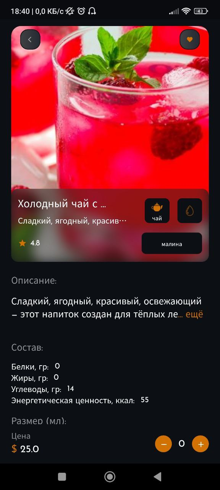
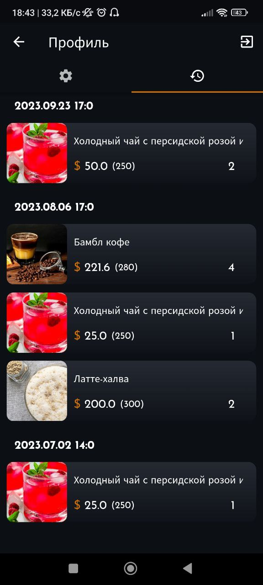

# Coffee shop

A small application for the sale of drinks






## Getting Started


Create an env.dart file in lib/const/
``
class Env {
static const String MAPBOX_KEY = "";
}

```
Execute the command

```
flutter pub get
```

Launch the emulator for the desired OS and press the F5 key.
There will be a build and installation in the emulator of the application

Make settings to work with your firebase

## Database update

You can fill the firebase database with temporary data by calling the necessary methods of the FirebaseCreateData class
```
final db = FirebaseCreateData();
await db.createProductsDB(productsMock);
```
In the database rules, you need to allow writing to the collection.

To be able to search by name, you need to generate data:
```
final db = FirebaseCreateSearchData();
db.createSearchDataDB(productsMock, "search_name");
```

## Assembly

For android, everything is done as standard by steps from the dock.

For ios, you need a macbook and Xcode.
Perform the necessary adjustments in General. Select Any as the device and create an Archive. The creation of the ipa will begin and then a distribution option will be offered.

## Used
- firebase
- animated_bottom_navigation_bar
- flutter_bloc
- hive
- get_it
- and other