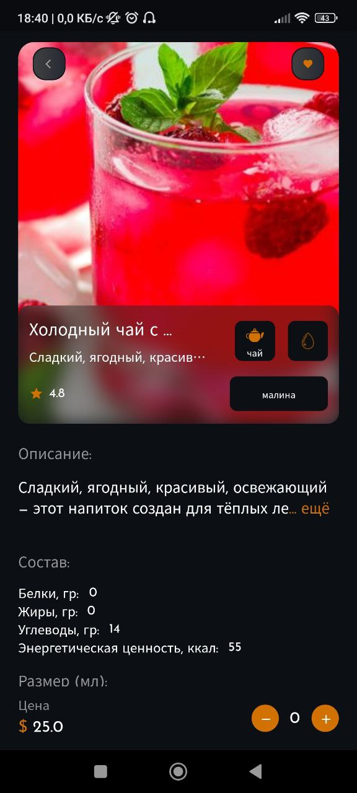

# Coffee shop

Небольшое приложение для продажи напитков





## Getting Started


Создать файл env.dart в lib/const/
```
class Env {
  static const String MAPBOX_KEY = "";
}

```
Выполнить команду

```
flutter pub get
```

Запусть эмулятор для нужной OS и нажать клавишу F5.
Произойдет сборка и установка в эмулятор приложения

Выполнить настройки для работы со своим firebase

## Обновление БД

Можно заполнить базу данных firebase временными данными вызвав нужные методы класса FirebaseCreateData
```
  final db = FirebaseCreateData();
  await db.createProductsDB(productsMock);
```
В правилах базы нужно разрешить запись в коллекции.

Для возможности поиска по названию, нужно сгенерировать данные:
```
final db = FirebaseCreateSearchData();
db.createSearchDataDB(productsMock, "search_name");
```

## Сборка

Для андроид все делается стандартно по шагам из документыции.

Для ios нужен macbook и Xcode.
Выполнить нужные насройки в General. Выбрать в качестве устройства Any и создать Archive. Начнется создание ipa и затем будет предложен вариант распространения.

## Использовалось
  - firebase
  - animated_bottom_navigation_bar
  - flutter_bloc
  - hive
  - get_it
  - и другое
