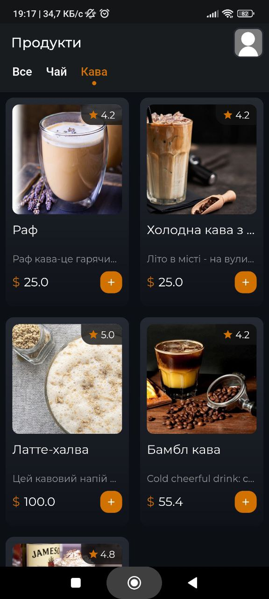
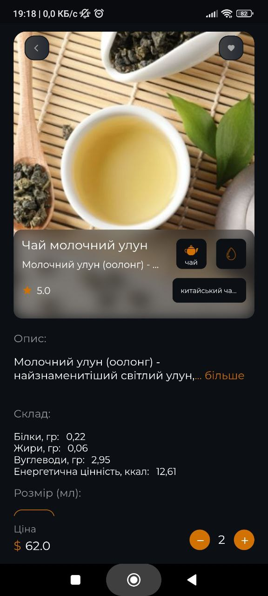
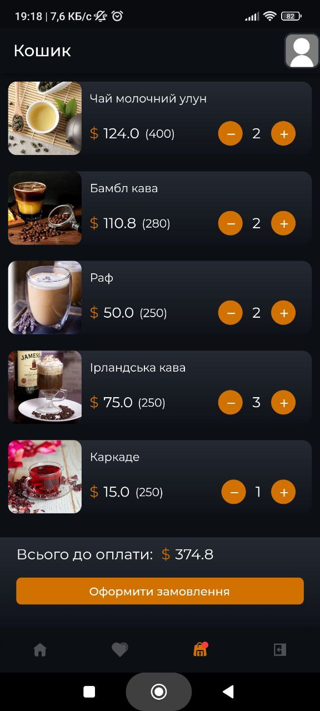

# Coffee shop

Невеликий мобільний додаток для продажу напоїв






## Getting Started

Створити файл env.dart в lib / const/
```
class Env {
static const String MAPBOX_KEY = "";
}

```
Виконати команду

```
flutter pub get
```

Запусть емулятор для потрібної OS і натиснути клавішу F5.
Відбудеться збірка і установка в емулятор додатки

Виконати налаштування для роботи зі соим firebase

## Оновлення БД

Можна заповнити базу даних firebase тимчасовими даними викликавши потрібні методи класу File Base Create Data
```
final db = FirebaseCreateData();
await db.createProductsDB(productsMock);
```
У правилах бази потрібно дозволити запис в колекції.

Для можливості пошуку за назвою, потрібно згенерувати дані:
```
final db = FirebaseCreateSearchData();
db.createSearchDataDB(productsMock, "search_name");
```
## Зборка

Для Андроїд все робиться стандартно по кроках з документації.

Для ios потрібен macbook і Xcode.
Виконати потрібні насройкі в General. Вибрати в якості пристрою Any і створити Archive. Почнеться створення ipa і потім буде запропонований варіант поширення.

## Багатомовність

Доступно 3 мови з коробки. Мова за замовчуванням використовується англійська. При додаванні нової мови слід оновити моделі.

## Використовувати
- firebase
- animated_bottom_navigation_bar
- flutter_bloc
- hive
- get_it
- flutter_localizations
- і інше